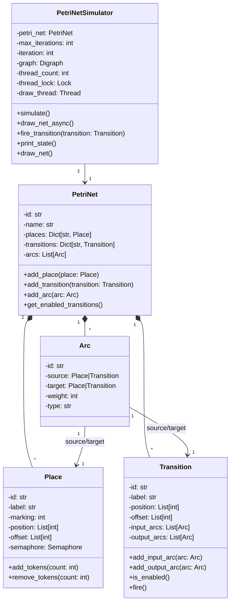
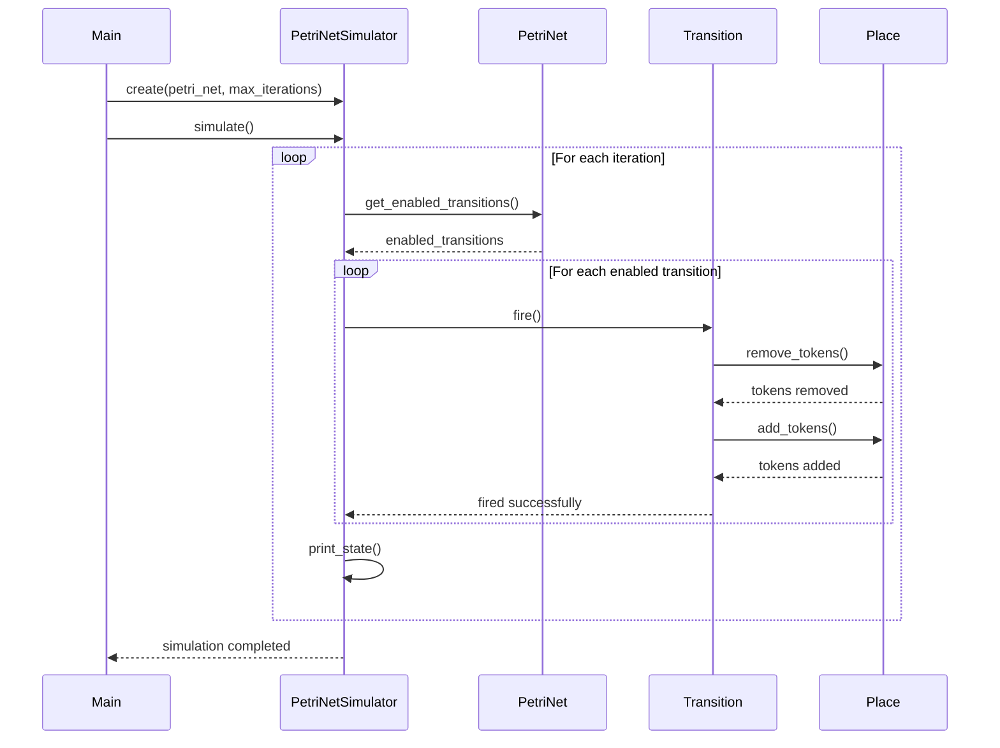

# Petri Net Simulator

This project implements a Petri net simulator with concurrent transition firing capabilities. It can parse Petri nets from PNML (Petri Net Markup Language) files and simulate their behavior.

## Key Components

1. **Place**: Represents a place in the Petri net. It can hold tokens and provides thread-safe methods for adding and removing tokens.

2. **Transition**: Represents a transition in the Petri net. It can be enabled or disabled based on the tokens in its input places and can fire to move tokens.

3. **Arc**: Represents a connection between a place and a transition. It can be an input arc (place to transition) or an output arc (transition to place).

4. **PetriNet**: Represents the entire Petri net, containing places, transitions, and arcs. It provides methods for adding these components and checking for enabled transitions.

5. **PetriNetSimulator**: Handles the simulation of the Petri net, including concurrent firing of transitions and visualization of the net's state.

## Concurrency and Threading

The simulator uses Python's `ThreadPoolExecutor` to fire enabled transitions concurrently. This allows for parallel execution of transitions, which can be particularly useful for large or complex Petri nets.

Key points about the threading implementation:

- Each enabled transition is submitted to the `ThreadPoolExecutor` for execution.
- The `fire_transition` method is called in a separate thread for each enabled transition.
- Thread-safe operations are ensured through the use of semaphores in the `Place` class for token manipulation.
- A `thread_lock` is used in the `PetriNetSimulator` to safely increment the thread count and assign unique thread IDs.

## Visualization

The simulator can generate visualizations of the Petri net at each step using the `graphviz` library. These visualizations are saved as PNG images in the `petri_net_images` directory.

## Usage

To use the simulator:

1. Prepare a PNML file describing your Petri net.
2. Run the `main()` function, specifying the path to your PNML file and the maximum number of iterations.
3. The simulator will parse the PNML file, create the Petri net, and run the simulation.
4. The simulation results, including the firing of transitions and the state of the net after each iteration, will be printed to the console.

## Future Improvements

- Implement more advanced Petri net features (e.g., inhibitor arcs, reset arcs).
- Add support for timed transitions and stochastic Petri nets.
- Improve visualization with interactive, real-time updates.
- Implement analysis tools for Petri net properties (e.g., reachability, liveness, boundedness).

# Class Diagram

# Sequence Diagram

