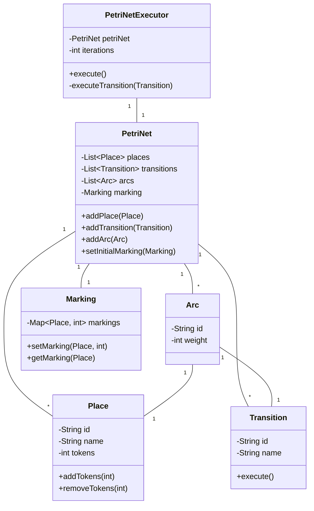

```mermaid
classDiagram
    class Place {
        -String id
        -String name
        -int tokens
        +addTokens(int)
        +removeTokens(int)
    }
    class Transition {
        -String id
        -String name
        +execute()
    }
    class Arc {
        -String id
        -int weight
    }
    class Marking {
        -Map~Place, int~ markings
        +setMarking(Place, int)
        +getMarking(Place)
    }
    class PetriNet {
        -List~Place~ places
        -List~Transition~ transitions
        -List~Arc~ arcs
        -Marking marking
        +addPlace(Place)
        +addTransition(Transition)
        +addArc(Arc)
        +setInitialMarking(Marking)
    }
    class PetriNetExecutor {
        -PetriNet petriNet
        -int iterations
        +execute()
        -executeTransition(Transition)
    }
    PetriNet "1" -- "*" Place
    PetriNet "1" -- "*" Transition
    PetriNet "1" -- "*" Arc
    PetriNet "1" -- "1" Marking
    Arc "1" -- "1" Place
    Arc "1" -- "1" Transition
    PetriNetExecutor "1" -- "1" PetriNet
```