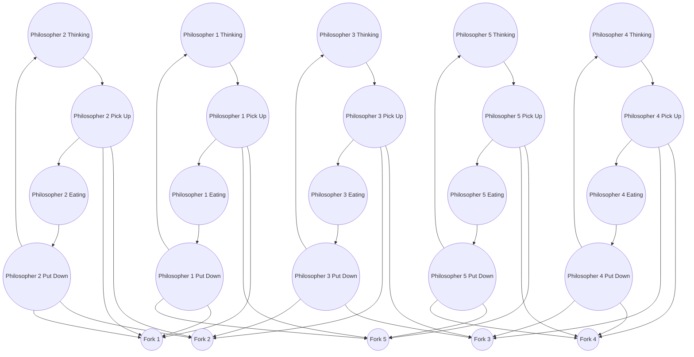

```mermaid
graph TD
    %% Places for forks
    Fork1((Fork 1))
    Fork2((Fork 2))
    Fork3((Fork 3))
    Fork4((Fork 4))
    Fork5((Fork 5))

    %% Places for philosophers' states
    Thinking1((Philosopher 1 Thinking))
    Thinking2((Philosopher 2 Thinking))
    Thinking3((Philosopher 3 Thinking))
    Thinking4((Philosopher 4 Thinking))
    Thinking5((Philosopher 5 Thinking))
    Eating1((Philosopher 1 Eating))
    Eating2((Philosopher 2 Eating))
    Eating3((Philosopher 3 Eating))
    Eating4((Philosopher 4 Eating))
    Eating5((Philosopher 5 Eating))

    %% Transitions for philosophers picking up forks
    Pickup1((Philosopher 1 Pick Up))
    Pickup2((Philosopher 2 Pick Up))
    Pickup3((Philosopher 3 Pick Up))
    Pickup4((Philosopher 4 Pick Up))
    Pickup5((Philosopher 5 Pick Up))

    %% Transitions for philosophers putting down forks
    Putdown1((Philosopher 1 Put Down))
    Putdown2((Philosopher 2 Put Down))
    Putdown3((Philosopher 3 Put Down))
    Putdown4((Philosopher 4 Put Down))
    Putdown5((Philosopher 5 Put Down))

    %% Arcs for Philosopher 1
    Thinking1 --> Pickup1
    Pickup1 --> Fork1
    Pickup1 --> Fork5
    Pickup1 --> Eating1
    Eating1 --> Putdown1
    Putdown1 --> Fork1
    Putdown1 --> Fork5
    Putdown1 --> Thinking1

    %% Arcs for Philosopher 2
    Thinking2 --> Pickup2
    Pickup2 --> Fork2
    Pickup2 --> Fork1
    Pickup2 --> Eating2
    Eating2 --> Putdown2
    Putdown2 --> Fork2
    Putdown2 --> Fork1
    Putdown2 --> Thinking2

    %% Arcs for Philosopher 3
    Thinking3 --> Pickup3
    Pickup3 --> Fork3
    Pickup3 --> Fork2
    Pickup3 --> Eating3
    Eating3 --> Putdown3
    Putdown3 --> Fork3
    Putdown3 --> Fork2
    Putdown3 --> Thinking3

    %% Arcs for Philosopher 4
    Thinking4 --> Pickup4
    Pickup4 --> Fork4
    Pickup4 --> Fork3
    Pickup4 --> Eating4
    Eating4 --> Putdown4
    Putdown4 --> Fork4
    Putdown4 --> Fork3
    Putdown4 --> Thinking4

    %% Arcs for Philosopher 5
    Thinking5 --> Pickup5
    Pickup5 --> Fork5
    Pickup5 --> Fork4
    Pickup5 --> Eating5
    Eating5 --> Putdown5
    Putdown5 --> Fork5
    Putdown5 --> Fork4
    Putdown5 --> Thinking5
```
