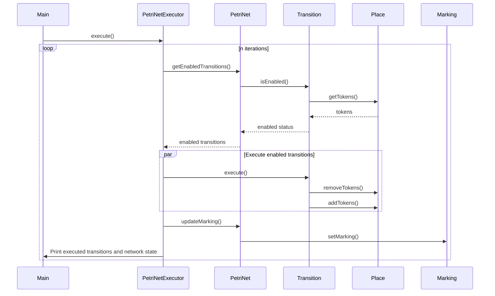

```mermaid
sequenceDiagram
    participant Main
    participant PetriNetExecutor
    participant PetriNet
    participant Transition
    participant Place
    participant Marking

    Main->>PetriNetExecutor: execute()
    loop n iterations
        PetriNetExecutor->>PetriNet: getEnabledTransitions()
        PetriNet->>Transition: isEnabled()
        Transition->>Place: getTokens()
        Place-->>Transition: tokens
        Transition-->>PetriNet: enabled status
        PetriNet-->>PetriNetExecutor: enabled transitions

        par Execute enabled transitions
            PetriNetExecutor->>Transition: execute()
            Transition->>Place: removeTokens()
            Transition->>Place: addTokens()
        end

        PetriNetExecutor->>PetriNet: updateMarking()
        PetriNet->>Marking: setMarking()
        PetriNetExecutor->>Main: Print executed transitions and network state
    end
```
