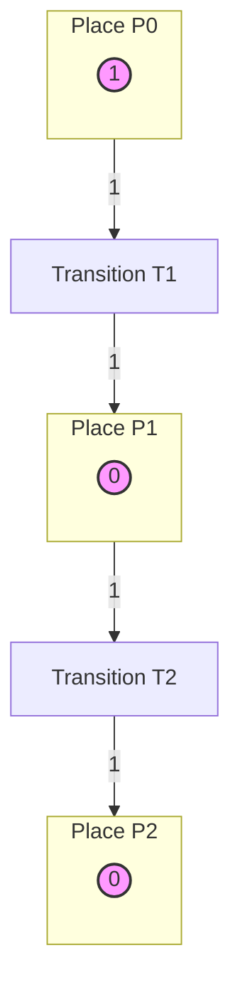

```mermaid
graph TD
    subgraph P0 [Place P0]
        p0_token1((1)):::token
    end
    subgraph P1 [Place P1]
        p1_token0((0)):::token
    end
    subgraph P2 [Place P2]
        p2_token0((0)):::token
    end

    P0 -->|1| T1[Transition T1]
    T1 -->|1| P1
    P1 -->|1| T2[Transition T2]
    T2 -->|1| P2

    classDef token fill:#f9f,stroke:#333,stroke-width:2px;
```
