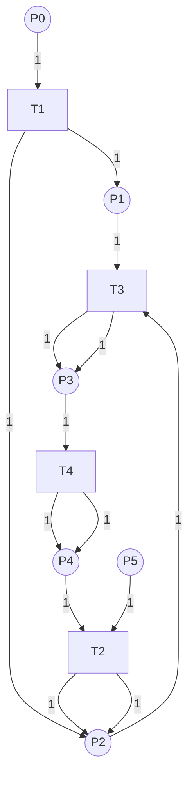

```mermaid
graph TD
    P0((P0)) --> |1| T1
    T1 --> |1| P1((P1))
    T1 --> |1| P2((P2))
    P2((P2)) --> |1| T3
    T2 --> |1| P2
    P1 --> |1| T3
    T3 --> |1| P3((P3))
    P3 --> |1| T4
    T4 --> |1| P4((P4))
    P4 --> |1| T2
    P5((P5)) --> |1| T2
    T2 --> |1| P2
    T3 --> |1| P3
    T4 --> |1| P4
```
